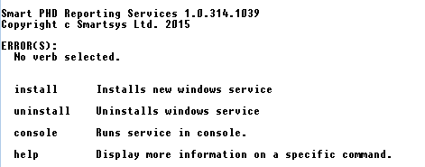
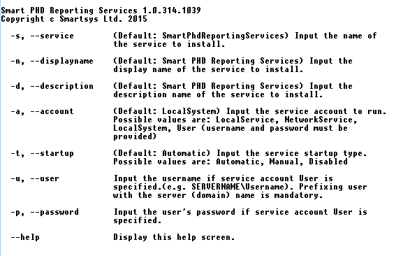
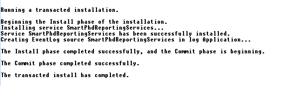
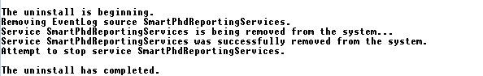
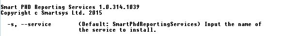
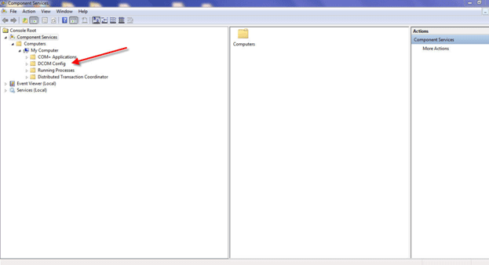
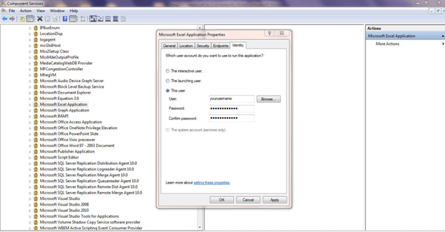
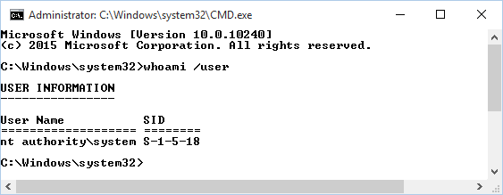
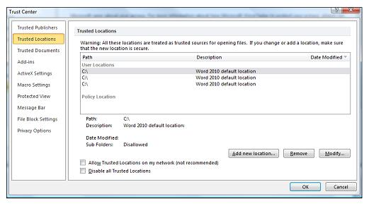

# Microsoft Excel Prerequisities

Please ensure that the following folders are created and if doesn't,
create them:

(for x86 and x64 OS)

**C:\\Windows\\System32\\config\\systemprofile\\Desktop**

(for x64 only)

**C:\\Windows\\SysWOW64\\config\\systemprofile\\Desktop**

This is needed to prevent "[Microsoft Excel cannot access the file
\'\<Temp File Location\>\'](#microsoft-excel-cannot-access-the-file-temp-file-location)".

For the latest **Microsoft Excel** releases it is necessary to add
"**TempFolder**" location from the
**Smart.Reporting.PhdReportingServices.Configuration.xml** file to the
**Microsoft Excel** **Trusted Locations**. Unfortunatelly this setting
is per user. By default the **Smart Reporting Service** runs under
**SYSTEM** account. You have 2 options:

1.  To use special tool **PsExec** (part of the **SysInternals's PsTools** package <https://technet.microsoft.com/en-us/sysinternals/pstools.aspx>) to
run the **Excel** under **SYSTEM** credential and to make the
change. In the appendices ("[**Getting a CMD prompt as SYSTEM in
Windows**](#getting-a-cmd-prompt-as-system-in-windows)") you can
read how to run **CMD** prompt under **SYSTEM** account from where
you can type and run **Excel** under the **SYSTEM** credential;

2.  To change the account under **Smart Reporting Service** is running
    and for this account the **Excel** settings change is made.

Hot to add add, remove, or change a **Trusted Location** in **Microsoft Excel** you can find in the appendices
[here](#add-remove-or-change-a-trusted-location-in-microsoft-excel).

# Manually registering Smart Reporting as Windows Service

Installation package automatically registers/deregisters **Smart
Reporting** as **Windows** service respectively on intall and uninstall,
so you can omit this point.

Open command windows into the installation folder of **Smart Reporting**
and type the following command:

```cmd
C:\Program Files (x86)\Smartsys Ltd\Smart Reporting Service> Smart.Reporting.PhdReportingServices.exe
```
and press **Enter**. You should see the following:



Fig. 1

The **Smart.Reporting.PhdReportingServices.exe** is the main binary of
the **Smart Reporting Service**. There are several commands shown:

**install** - this command installs **Smart Reporting** as **Windows
Service**;

**uninstall** - this command uninstalls **Smart Reporting Windows
Service**;

**console** - this command runs **Smart Reporting Service** like a
regular console program;

**help** - displays more information on a specific command.

If you type 

```cmd
C:\Program Files (x86)\Smartsys Ltd\Smart Reporting Service> Smart.Reporting.PhdReportingServices.exe help install
```

and press **Enter**, you should see the following:



Fig. 2

You can see detailed help information about options for the install
command. If you do not specify an options, the default values will be
used. For example if you do not specify service startup type, by default
it will be automatic.

For example if you want to install the service, specifying a user
account you can do the following:

```cmd
C:\Program Files (x86)\Smartsys Ltd\Smart Reporting Service> Smart.Reporting.PhdReportingServices.exe --a User -u .\theUser -p thePassword
```

After typing the command above and pressing Enter you
should see this:



Fig. 3

Now if you want to start the service, the only thing you need to do is
to type:

```cmd
C:\Program Files (x86)\Smartsys Ltd\Smart Reporting Service>net start SmartPhdReportingServices
```

You should see the following result:


Fig. 4

If your service fails to start you should check the server log files for
errors ("**C:\\Program Files (x86)\\Smartsys Ltd\\Smart Reporting
Service\\Logs**") and also should check windows application event logs
for errors, because the fail may happen before intialziation of logging.

*``Remark:`` The user under the service is started must be elevated or to
have access to the server folders to read required files and to write
logs.*

*``Remark:`` Stopping the service takes longer time than starting it. If
you type "**net stop SmartPhdReportingServices**" you may receive the
following:*


Fig. 5

Usually this is not a problem, stopping really takes a longer time and
if you check from services tab after few minutes you will see that the
service really is stopped.

If you want to uninstall the service, first stop it, after that type the
following in the command window:

```cmd
C:\Program Files (x86)\Smartsys Ltd\Smart Reporting Service>Smart.Reporting.PhdReportingServices.exe uninstall
```

You should see the following:



Fig. 6

*``Remark:`` By default windows service is named
**SmartPhdReportingServices**, but it can be changed with the "**-s**"
option of the install command, which we do not recommend, but if it is
done then you must specify the service which to be uninstalled with the
"**-s**" option of the uninstall command.*



Fig. 7

*``Remark:`` Display name of the service, which is shown in the services
tab is different from the name of the service, used for starting and
stopping with the "**net**" command.*

# Microsoft Excel cannot access the file \'\<Temp File Location\>\'

__Possible reasons:__

- The file name or path does not exist;

- The file is being used by another program;

- The workbook you are trying to save has the same name as a currently
open workbook.

__Resolution:__

Create folders

(for x86 and x64 OS)

**C:\\Windows\\System32\\config\\systemprofile\\Desktop**

(for x64 only)

**C:\\Windows\\SysWOW64\\config\\systemprofile\\Desktop**

If it does not help try this <http://support.microsoft.com/kb/2817505>.

# Exception from HRESULT: 0x800A03EC - Excel, .Net, SQL and Windows Server

If you have some error like `System.Runtime.InteropServices.COMException (0x800A03EC): Microsoft Excel cannot open or save any more documents  ecause there is not enough available memory or disk space.`

Then you have to give **Smart PHD Reporting Service** permission:

1.  Login to the server as a administrator;

2.  Stop the service automating **Excel** (**Smart PHD Reporting
    Service** ) if it is running;

3.  Go to "**Start**" -\> "**Run**" and enter "**taskmgr**";

4.  Go to the process tab in task manager and check "**Show Processes
    from all users**";

5.  If there are any "**Excel.exe**" entries on the list, right click
    on the entry and select "**End Process**"

6.  Close task manager;

7.  Go to "**Start**" -\> "**Run**" and enter "**dcomcnfg**" (for
    32 bit Excel run "**mmc comexp.msc /32"**);

8.  This will bring up the component services window, expand out
    "**Console Root**" -\> "**Computers**" -\> "**DCOM Config**";
    
    
     

9.  Find "**Microsoft Excel Application**" in the list of components;

10. Right click on the entry and select "**Properties**";

11. Go to the "**Identity**" tab on the properties dialog;

12. Select "**The user**" and enter credentials of the user accout
    under reporting service is running (e.g. **SmartWebViewOnly**);
    
    

13. Click the "**OK**" button;

14. Switch to the services console;

15. Start the service automating **Excel** (**Smart PHD Reporting Service**);

16. Make a test.


# Creating HTTPS Certificate

You can either create your certificates by
[makecert](http://msdn.microsoft.com/en-us/library/bfsktky3%28v=vs.80%29.aspx)
or by [OpenSSL](http://www.openssl.org/). And this [How to Setup a
CA](http://pages.cs.wisc.edu/~zmiller/ca-howto/) gives you an easy
tutorial of creating certificates hierarchy by **OpenSSL**. First is the
root CA certificate. For experimental cases, **makecert** is enough. But
for product, you may want to use **OpenSSL** or apply a certificate from
CA like VeriSign.

`makecert -n "CN=TestCA" -r -sv TestCA.pvk TestCA.cer`

And import the root certificate to the system certificate storage of
Trusted Root Certification Authority. [See this article](http://www.codeproject.com/Articles/25677/Simple-WCF-X509-Certificate).

Then create the certificate for your HTTPS web site.

`makecert -iv TestCA.pvk -n "CN=TestSite" -sv TestSite.pvk -ic TestCA.cer TestSite.cer -sr LocalMachine -ss My -sky exchange --pe`

If you will test your client app on a machine other than the server
machine, you have to import the **TestCA.cer** to the client machine as
well. So that the client machine trust **TestCA** (the root cert), it
will also trust the server certificate (**TestSite**).

Hosting an HTTPS site, you must have a certificate with private key. But
the last **makecert** command creates the private key in **TestCA.pvk**
which can't be imported to the system storage directly. We have to
convert it to **.pfx** format

`pvk2pfx -pvk "TestSite.pvk" -spc "TestSite.cer" -pfx "TestSite.pfx"`

You have to import **TestSite.pfx** into the Local Computer Personal
Certificate store.

# Getting a CMD prompt as SYSTEM in Windows

- Download **PsExec** part of the **PsTools** from the **SysInternals
(<https://technet.microsoft.com/en-us/sysinternals/pstools.aspx>);

- Open an elevated **CMD** prompt as an administrator;

- Navigate to the folder where you unzipped **PsTools's PsExec.exe;**

- Run: `PSEXEC -i -s -d CMD`

You will have a new **CMD** prompt open, as though by magic;

Type the following in the new CMD prompt to prove who you are:

`WHOAMI /USER`



There you go - anything that happens in that **CMD** prompt or is
spawned from that prompt will be running as **SYSTEM**. You could
run **regedit** from here, start **explorer**, or whatever you need to
troubleshoot as that account.

For more information visit
<http://blogs.technet.com/b/askds/archive/2008/10/22/getting-a-cmd-prompt-as-system-in-windows-vista-and-windows-server-2008.aspx>.

# Add, remove, or change a trusted location in Microsoft Excel

You should use a trusted location to store a file when you don\'t want
that file to be checked by the Trust Center, or if you don\'t want it to
open in [Protected View](https://support.office.com/en-us/article/Protected-View-d6f09ac7-e6b9-4495-8e43-2bbcdbcb6653).
This applies particularly to files with macros, data connections,
ActiveX controls (what we call active content). If you think the active
content in a file is from a reliable source, it's better to move the
file to a trusted location, instead of changing the default Trust Center
settings to a less-safe macro security setting.



**Add a trusted location**

1.  Click **File** \> **Options**.

2.  Click **Trust Center** \> **Trust Center Settings** \> **Trusted
    Locations**.

3.  Click **Add new location**.

4.  Click **Browse** to find the folder, select a folder, and then
    click **OK**.

**Remove a trusted location**

1.  Click **File** \> **Options**.

2.  Click **Trust Center** \> **Trust Center Settings** \> **Trusted
    Locations**.

3.  Select the location to be removed, and then click **Remove**, and
    then click **OK**.

**Change a trusted location**

1.  Click **File** \> **Options**.

2.  Click **Trust Center** \> **Trust Center Settings** \> **Trusted
    Locations**.

3.  In the **Trusted Locations** list, select a location, and then
    click **Modify**.

4.  Make the modifications you want, and then click **OK**.

**Applies To: **PowerPoint 2010, Visio Professional 2013, Office 2010,
Excel 2010, Word 2010, Word 2016, Access 2013, Excel 2016, Word 2013,
Access 2010, PowerPoint 2013, Visio 2010, PowerPoint 2016, Visio
Professional 2016, Visio 2013, Access 2016 Developer, Visio Standard
2010, Excel 2013

For more information look [here](https://support.office.com/en-us/article/Add-remove-or-change-a-trusted-location-7ee1cdc2-483e-4cbb-bcb3-4e7c67147fb4).