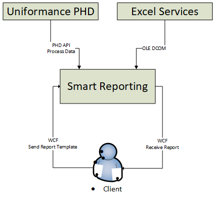

**Smart Reporting Service** enalbes users to perform production reports
using historical process data from **Uniformance PHD**. The report is a
**Microsoft** **Excel** template file with **\*.xlt** extension that
contains specific parse phrases which are processed by an interpreter.
When a report is performed, **Smart Reporting** extracts data from the
**Uniformance PHD** server and returns the filled report.

Fig. 1

**Figure 1** Illustrates a simple diagram of the **Smart Reporting
Service**. A client sends report template to the **Smart Reporting**.
**Smart Reporting** opens the template, reads and parses commands,
fetches data from **Uniformance PHD**, fills data into the template and
sends processed report to the client.