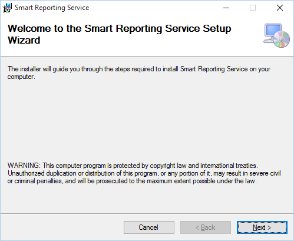
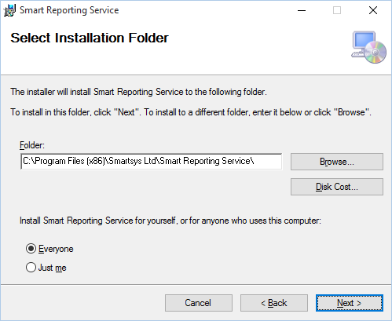
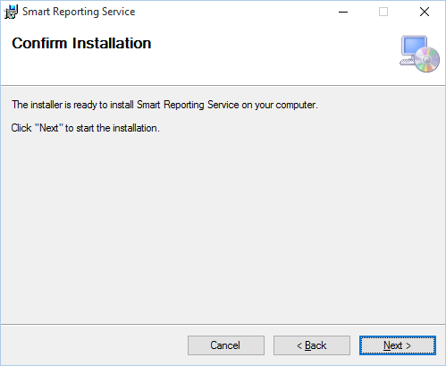
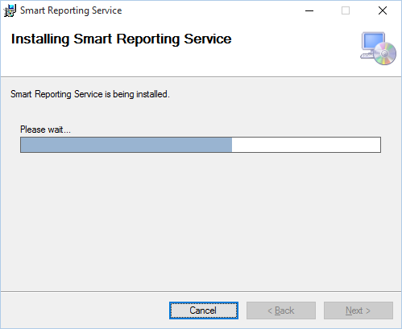
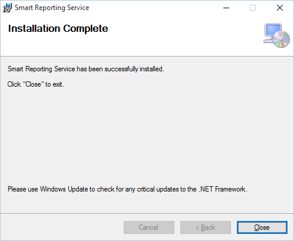

   
## Prerequisites

- Operating system **Windows 7** / **Windows 2008 Server** or newer;

- **.Net Framework 4.5.1** - You can download and install it from
[here](http://www.microsoft.com/en-us/download/details.aspx?id=40779)
or use the web installer from
[here](http://www.microsoft.com/en-us/download/details.aspx?id=40773)
;

- **PHD APINET**;

- **Microsoft Excel**;

- **Smart Reporting Setup** package x86 or x64 release.

## Running Setup

Run the **Smart Reporting** setup package e.g. 
**Smart Reporting Setup x86 1\_0\_314\_1039.msi**.



Fig. 2

You will see the dialog as shown above. Press the "**Next**" button.



Fig. 3

Press the "**Next**" button.



Fig. 4

Press the "**Next**" button.



Fig. 5

Wait until installation completes.



Fig.6

When installation is completed you will see the dialog as shown above.
Press "**Close**" button. The program is installed in  
**"%SystemDrive%:\\Program Files (x86)\\Smartsys Ltd\\Smart Reporting Service**".

### PHD API NET

**Smart Reporting Service** uses **PHD API NET** to fetch historical
process data from **Uniformance PHD**. **PHD API NET** is part of the
**Uniformance PHD** distribution package. You must install **PHD API NET** 
from the vendor's distribution package (**Uniformance PHD Client**
or **TPI Desktop** - depends on **PHD** version) and to copy the
appropriate **phdapinet.dll** to the "**&lt;InstallDir&gt;\\Lib**" folder.
Usually it is located in  
"**C:\\Program Files (x86)\\Common Files\\Honeywell\\Uniformance**" or  
"**C:\\Program Files\\Common Files\\Honeywell\\Uniformance**", depending on platform.

*``Remark:`` Platform (**x86** or **x64**) of the copied phdapinet.dll must be the
same as platform of the installed **Smart Reporting Service**. If the
**.NET Framework** is **4.6** or greater you must use **x86** version of service and
**PHD API NET** library. If your **PHD API NET** version is greater than
**215.1.0.1** you must open
"**Smart.Reporting.PhdReportingServices.exe.config**" configuration file and
to uncomment or add the "**dependentAssembly**" section and to configure
bindingRedirect for the phdapinet assembly. For that purpose, you must
know the new version of phdapinet and fill it in 2 places -
"**oldVersion**" and "**newVersion**" attributes.*

__Example:__

```xml
<configuration>
  <runtime>
    <assemblyBinding xmlns="urn:schemas-microsoft-com:asm.v1">
      <probing privatePath="Lib; Bin"/>

      <!-- Uncomment this section to configure binding redirect when PHDAPINET is newer version. -->
      <dependentAssembly>
        <assemblyIdentity name="phdapinet" publicKeyToken="5c915cbb2b8fbc32" culture="neutral" />
        <!-- Assembly versions can be redirected in app,  publisher policy, or machine configuration files. -->
        <bindingRedirect oldVersion="215.1.0.0-300.1.0.1" newVersion="300.1.0.1" />
        <!-- Publisher policy can be set only in the app configuration file. -->
        <publisherPolicy apply="no" />
      </dependentAssembly>

    </assemblyBinding>
  </runtime>
  <startup>
    <supportedRuntime version="v4.0" sku=".NETFramework,Version=v4.5.1" />
  </startup>
</configuration>
```