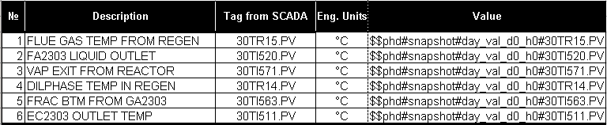
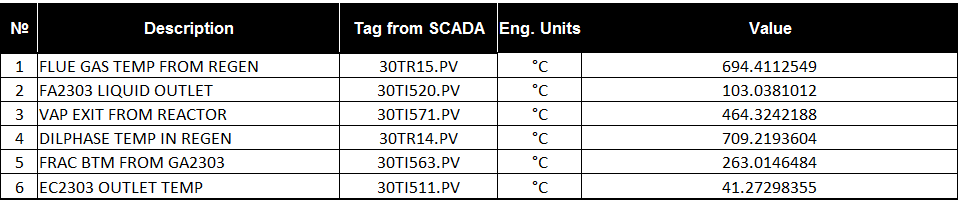
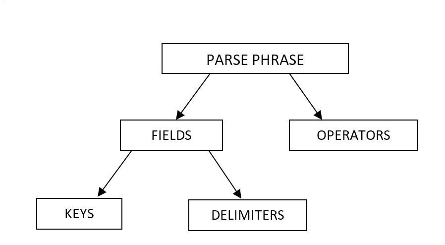

The report is a **Microsoft Excel** template file with **\*.xlt**
extension that contains specific parse phrases which are processed by an
interpreter. When a report is performed the service extracts data from
the **PHD** server and fills the report with it. The syntax and the
performed operations are described in the next section.

In the next figure is shown a typical example of report template. The
cells starting with `$$` will be processed by the interpreter when
the report is called.

> 

Figure 7 - Sample report template

After the report is generated the cells which started with **\$\$** in
the figure above are now filled with data from the **PHD** server. The
result after calling the report is shown below.

Figure 8 - Result of the sample report

# Performed Operations

The interpreter supports several operations for handling data. The cells
of a template file which are defined as parse phrases, describe the
information that needs to be extracted. Process data is contained in
**PHD** tags and interpreter's function is to extract the required data,
as specified in the parse phrases, and to fill the report template with
it. The syntax of parse phrases and the possible operations are
described further in this chapter.

## Parse Phrase Structure

The term "**parse phrase**" always applies to a whole cell. If the cell
starts with `$$` its whole content will be interpreted as a parse
phrase. A parse phrase consists of fields and operators. The operators
are always preceded by a field. The number of fields and operators used
is unlimited. On the other hand a field consist of keys and delimiters.

Figure 9 - Parse phrase